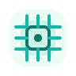

  

  <h2>你好呀，我是 HalloYang</h2>
  
  

    这里更像我的个人工作台：放一点学习轨迹、技术栈、工具偏好，以及慢慢做出来的小作品。
  

  

    
    
    
    
  

---

## 最近在学

<table align="center">
  <tr>
    <td width="33%" align="center">
      
      <h3>机器人</h3>
      
ROS、CAN/EtherCAT通信、运动学控制、系统联调

    </td>
    <td width="33%" align="center">
      
      <h3>嵌入式</h3>
      
C/C++、Linux、RTOS、外设调试

    </td>
    <td width="33%" align="center">
      
      <h3>硬件设计</h3>
      
原理图、PCB、电源设计、电机驱动

    </td>
  </tr>
</table>

---

## 技术工具箱

  <h3>嵌入式开发</h3>
  

    
    
    
    
    
    
    
    
  

  <h3>机器人与控制</h3>
  

    
    
    
   
  

  <h3>硬件设计</h3>
  

    
    
    
    
    
  

  
  
  

